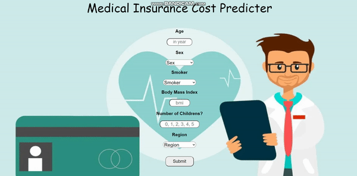

## Insurance Expenses Prediction Project

...
This project contains necessary files for deploying a web application.
...

## Problem need to be solved

Predict an insurance expenses for new customer based on some attributes and informations.
...

## Demo

...

## Technology used

-   Python
-   Machine Learning
-   Pandas
-   Numpy
-   Scikit-learn
-   Flask
-   HTML
-   CSS
-   Pycharm
-   Heroku
    ...

# Running Test
